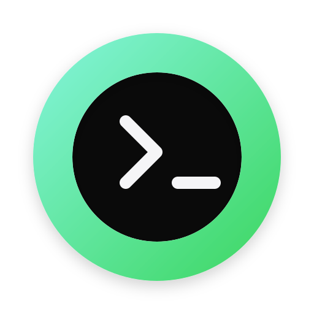
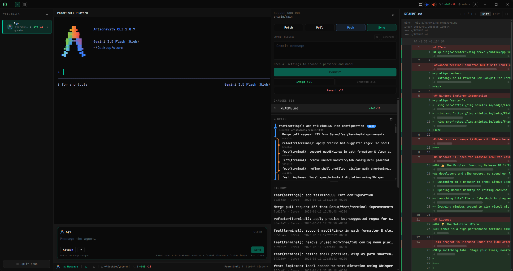

# <p align="center"><br>OTerm</p>

<p align center>
  <strong>The AI-Powered Dev-Cockpit for Terminal-Native Developers & Vibe Coders.</strong>
</p>

<p align="center">
  
  
  
</p>

---

### ⚠️ The Problem: Bouncing Between 10 Different Tools
As developers and vibe coders, we spend our lives in the terminal. Yet, we are constantly forced to break our flow state and bounce back and forth between multiple heavy applications:
- Switching to a browser to check GitHub Issues or stage Pull Requests.
- Opening Docker Desktop or writing endless `docker ps -a` loops just to monitor container logs.
- Launching FileZilla or Cyberduck to drag and drop files over SFTP.
- Dragging windows around to view visual git diffs or commit graphs.

### 💡 The Solution: OTerm
**OTerm** is a high-performance terminal emulator that bridges the gap between CLI speed and GUI convenience. Built on **Tauri 2**, **Vue 3**, and **Tailwind CSS v4**, OTerm embeds rich, visual, Rust-powered developer tools directly into your terminal workspace. 

Stop switching tabs. Stage your lines, monitor your containers, browse your remote servers, and query local AI models—**all from a single, cohesive terminal dashboard.**

---

## 📸 Overview & Dashboard



---

## 🚀 Key Features

### 🎙️ 1. Hardware-Accelerated Local Dictation (Whisper)
Compose prompts, write commit messages, or execute actions entirely with your voice. OTerm features a fully local, offline speech-to-text dictation system powered by `whisper-rs`, `cpal`, and `hound`.
- **Offline & Private**: Default model `ggml-tiny.bin` is cached locally under `~/.oterm/whisper-models/`.
- **GPU Accelerated**: Native acceleration via **Metal** (macOS), **Vulkan** (AMD/Intel on Windows & Linux), **CUDA** (NVIDIA on Windows & Linux), or **OpenBLAS** CPU fallback (Linux).

### 🤖 2. Integrated AI Assistant & Autocomplete
OTerm features an integrated AI Agent Composer and autocomplete helper to turbocharge your "vibe coding" sessions. It's completely configurable with your favorite AI backend:
- **LM Studio**: Run local, completely free, and private models on `http://localhost:1234/v1` with zero API keys.
- **GitHub Copilot**: Auto-loads your existing Copilot OAuth token straight from your disk configuration.
- **BYOK (Bring Your Own Key)**: Compatible with any OpenAI-compliant API endpoint (including OpenAI, OpenRouter, Azure OpenAI, vLLM, etc.).

### 🐙 3. The Visual Git Suite
No need for heavy Git GUIs or browser tabs. Manage your repositories natively:
- **Interactive Commit Graph**: A visual branch tree (`git log --graph` reimagined) to easily trace history.
- **Visual Diff Viewer**: Built-in side-by-side diffing and precise staging of specific lines or hunks.
- **Branch Manager**: Worktree-aware branch switching and merging built directly into the title bar.
- **GitHub Portal**: Open, view, and manage GitHub Issues and Pull Requests right from the sidebar.
- **Commit message AI**: Let the AI automatically generate conventional, semantic commit messages based on your staged changes.

### 🐳 4. Direct Docker Dashboard
Keep an eye on your microservices without cluttering your shell:
- Live container status monitoring (running, paused, stopped).
- Instant logs streaming, container control (start, stop, restart), and image/volume exploration.

### 🔌 5. SSH & SFTP Connection Hub
Seamlessly connect to remote servers and manage files with our custom, Rust-backed SSH/SFTP client:
- Multi-session SSH terminal panes.
- Dual-panel graphical SFTP file browser with file uploads, downloads, and directory management.

---

## 🛠️ Tech Stack & Architecture

OTerm uses a vertical-slice architecture to marry front-end flexibility with back-end safety:
- **Frontend**: Vue 3 + TypeScript + Vite + Tailwind CSS v4. Terminal rendering is powered by `@xterm/xterm` with the `@xterm/addon-fit` addon.
- **Desktop Wrapper**: Tauri 2 provides the secure native bridge and system integrations.
- **Backend (Rust)**: High-performance modules under `src-tauri/src/` for multi-threaded SSH, local Whisper audio processing, Docker socket communication, and Git IPC commands.

---

## ⚡ Getting Started (For Developers)

### 📋 Prerequisites

To compile the native Whisper and Tauri modules, your machine needs:
- **Node.js** `>= 22`
- **Rust Toolchain** (stable) with `rustfmt` + `clippy` components.
- **CMake** & a **C++ Toolchain** (e.g., Build Tools for Visual Studio on Windows, Xcode on macOS).
- **Whisper backend (compile-time)**: OTerm ships multiple release builds per platform. Pick one backend when building locally:
  - **macOS**: `whisper-metal` (default via `npm run tauri`)
  - **Windows**: `whisper-vulkan` (default) or `whisper-cuda` for NVIDIA
  - **Linux**: `whisper-vulkan` (default), `whisper-cuda` (NVIDIA), or `whisper-openblas` (CPU)
  - Override with `OTERM_WHISPER_BACKEND=cuda|vulkan|openblas|metal` or pass `--features whisper-<backend>` to Cargo/Tauri.
- **GPU / native build dependencies**:
  - **Windows (Vulkan)**: [Vulkan SDK](https://vulkan.lunarg.com/) + LLVM/libclang (auto-detected by `scripts/tauri.mjs`).
  - **Windows (CUDA)**: NVIDIA CUDA toolkit + LLVM/libclang for local builds. Published **OTerm CUDA** Windows installers bundle the required CUDA runtime DLLs; end users do not need the CUDA toolkit installed.
  - **macOS**: Xcode Command Line Tools (Metal).
  - **Linux (Vulkan)**: `libvulkan-dev`, `glslang-tools`, and a C++ toolchain.
  - **Linux (CUDA)**: NVIDIA CUDA toolkit.
  - **Linux (OpenBLAS)**: `libopenblas-dev`.

### 📦 Installation & Setup

1. **Clone the repository**:
   ```bash
   git clone https://github.com/username/oterm.git
   cd oterm
   ```

2. **Install Node dependencies**:
   ```bash
   npm ci
   ```

3. **Run the desktop app in development mode**:
   ```bash
   npm run tauri dev
   ```
   *Note: The first build compiles the `whisper.cpp` C++ bindings, which can take several minutes. Subsequent builds are near-instantaneous.*

---

## 🧪 Testing & Verification

We enforce a strict quality gate to ensure OTerm builds cleanly and works flawlessly across Windows, macOS, and Linux.

Run the following commands from the repository root to verify code correctness:

```bash
# 1. Frontend Typecheck
npx vue-tsc --noEmit

# 2. Frontend Unit Tests (Vitest)
npm test

# 3. Production Frontend Build
npm run build

# 4. Rust Backend Linting (Clippy & Fmt)
# Windows: use a short target dir to avoid MAX_PATH failures in the Vulkan Whisper build.
# PowerShell: $env:CARGO_TARGET_DIR = "C:\oterm-t"
cd src-tauri
WHISPER_FEATURE=$(node ../scripts/whisper-backend.mjs)
cargo fmt --all -- --check
cargo clippy --all-targets --features "$WHISPER_FEATURE" -- -D warnings

# 5. Rust Unit & Integration Tests
cargo test --lib --features "$WHISPER_FEATURE"
cargo test --features "$WHISPER_FEATURE"  # pty integration tests (requires pwsh on Windows)
cd ..

# 6. Full Desktop Build
npm run tauri build
```

---

## 🤝 Contribution & AI Commits

We welcome contributions from the community! If you are using an AI assistant to make code contributions, please ensure your commits include proper attribution:

```text
Co-Authored-By: <Agent Name> <noreply@anthropic.com>
```

## 📄 License

This project is licensed under the [GNU Affero General Public License v3.0 or later](LICENSE) (AGPL-3.0).
